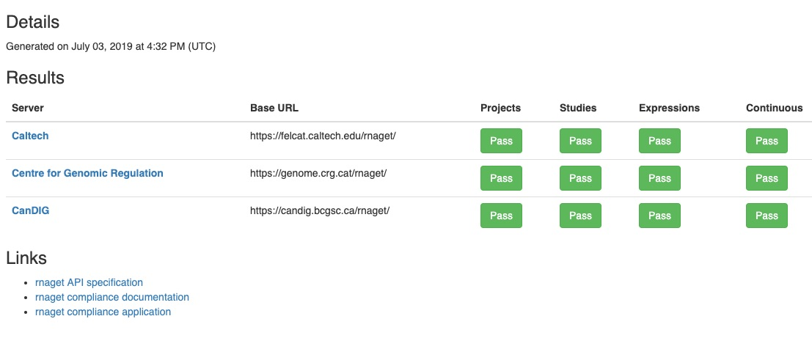
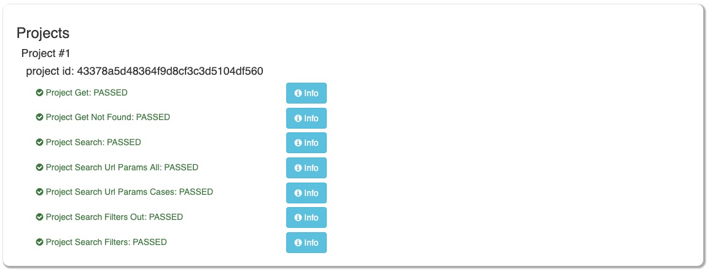
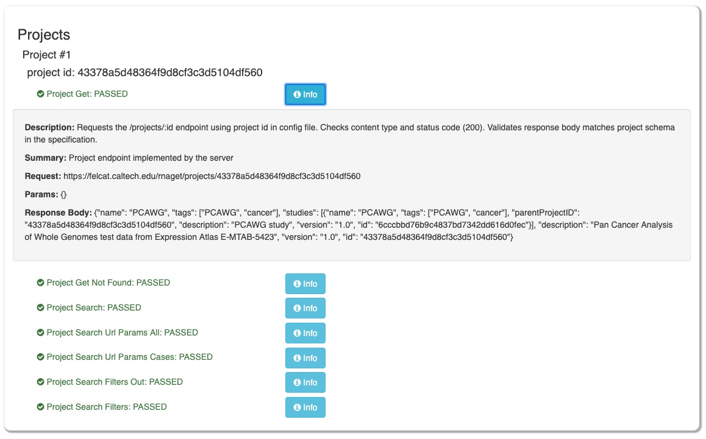

Viewing the Report
==================

Once the compliance report has been generated, the HTML report can be accessed by
first starting a web server at the output directory, then navigating to the page
via web browser.

Report: Index
-------------

The report index page displays a tabular overview of test successes/failures by
tested servers and API routes. An example report index is displayed below:

Clicking on any of the *Pass*/*Fail* buttons will take you to a breakdown of 
test results for that server. 

Report: Test Breakdown
----------------------

This page shows a more detailed report of all tests run on a particular server,
organized by API route and test case. For any given test, clicking the *Info*
button will display information for that test, including the request URL, 
parameters, and the response body. The *Info* window is also helpful in 
diagnosing failed compliance tests, as it reports the type of error 
encountered and related debug messages.

Below is an example of *Projects* test results for one server in the test
breakdown page:

Clicking the *Info* button shows test information, displayed below:

The `next section <../tests/overview.html>`_ delineates the exact compliance 
tests performed for each API route, including the rationale and success 
criteria behind each test.